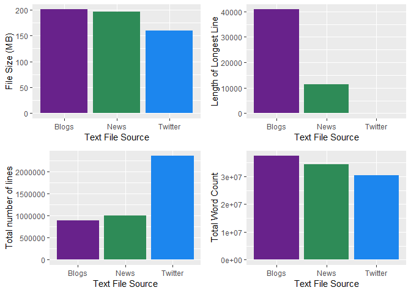
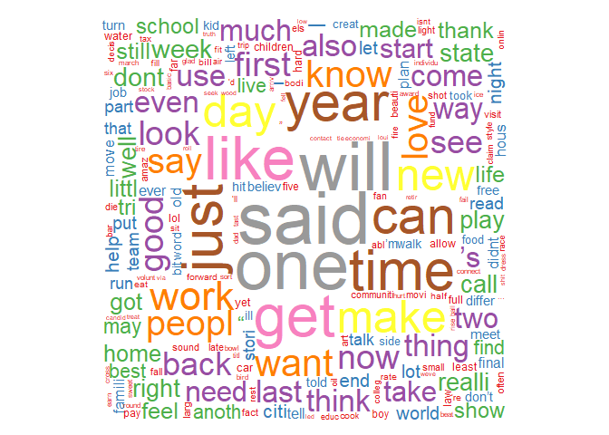
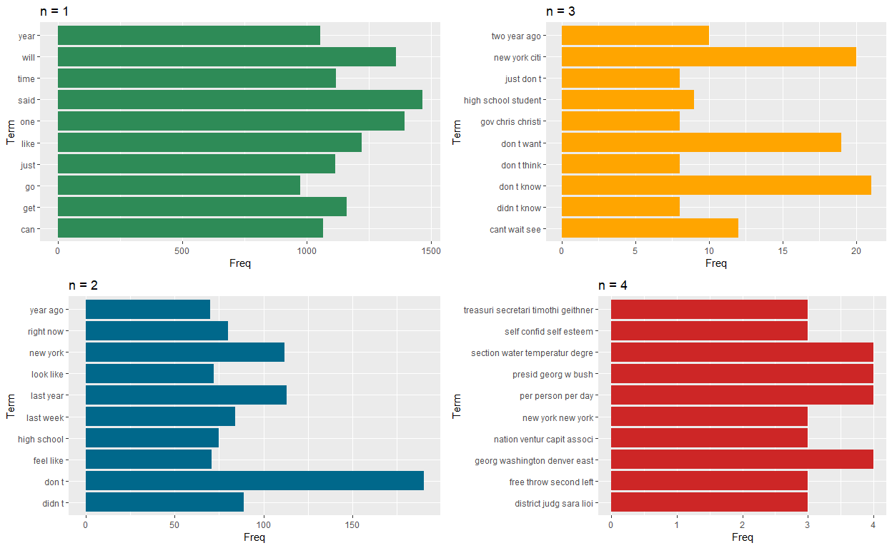

## 1 - **Introduction**
 
Around the world, people are spending an increasing amount of time on their mobile devices for email, social networking, banking and a whole range of other activities. But typing on mobile devices can be a serious pain. SwiftKey, our corporate partner in this capstone, builds a smart keyboard that makes it easier for people to type on their mobile devices. One cornerstone of their smart keyboard is predictive text models. When someone types:

I went to the

the keyboard presents three options for what the next word might be. For example, the three words might be gym, store, restaurant. In this capstone you will work on understanding and building predictive text models like those used by SwiftKey.

The main goal of this milestone report is to introduce and explain the basic exploratory analysis conducted on the dataset provided for the Data Science Coursera Specifialization Capstone Project. 

The dataset can be found here: https://d396qusza40orc.cloudfront.net/dsscapstone/dataset/Coursera-SwiftKey.zip.

Furthermore, we will discuss our plans for creating a prediction model and plan out the next steps needed to ensure our model is as accuarte and efficient as possible. The end product will be a Shiny app that will employ our model to predict the next words based on user input. 

## 2 - **Basic Exploratory Analysis**

### 2.1 - Loading needed R packages and datasets


```r
library(tm)
library(SnowballC)
library(stringi)
library(filehash)
library(RWeka)
library(RWekajars)
library(NLP)
library(rJava)
library(wordcloud)
library(RColorBrewer)
library(ggplot2)
library(knitr)
```
The provided dataset from HC Corpora has a collection of texts from Twitter, Blogs, and News in 4 different languages. For our model we will only use the English texts. So our samples of text will come from the following files:

* en_US.blogs.txt
* en_US.news.txt
* en_US.twitter.txt

These three English text files are loaded and read into R  

```r
## Loading in files and main data ##
mainFile <- "./final/en_US"
mainBlog <- "./en_US.blogs.txt"
mainTwitter <- "./en_US.twitter.txt"
mainNews <- "./en_US.news.txt"

## Setting connections to files so they can be read into R ##
con1 <- file(mainBlog, open = "rb") #read in using binary mode 
blogs <- readLines(con1, encoding = "UTF-8", skipNul = TRUE)
close(con1)
con2 <- file(mainTwitter, open = "rb")
twitter <- readLines(con2, encoding = "UTF-8", skipNul = TRUE)
close(con2)
con3 <- file(mainNews, open = "rb")
news <- readLines(con3, encoding = "UTF-8", skipNul = TRUE)
close(con3)
```

### 2.2 - Basic Data Summary and Analysis 

Now that all the English text files have been loaded and read into R. We'll conduct some basic analysis to explore some key characteristics of the files in order to better understand our dataset before building any predictive models. Key features that we will explore for each file include file size, number of lines, longest line, and word count. 


```r
## fileSize ##
blogSize <- file.info(mainBlog)$size / 1024^2
twitSize <- file.info(mainTwitter)$size / 1024^2
newSize <- file.info(mainNews)$size  / 1024^2
## lineCount ##
blogLen <- length(blogs)
twitLen <- length(twitter)
newsLen <- length(news)
## wordCount ##
blogWC <- sum(stri_count_words(blogs))
twitWC <- sum(stri_count_words(twitter))
newsWC <- sum(stri_count_words(news))
## longest lines ##
blogMax <- max(nchar(blogs))
twitMax <- max(nchar(twitter))
newsMax <- max(nchar(news))
```

All of these characteristics are compiled into a dataframe so we can easily compare the characteristics for each file. 


```r
## compiling file summaries into dataframe ## 
summaryDF <- data.frame(fileName = c("Blogs", "Twitter", "News"),
                        fileSizeMB = c(blogSize, twitSize, newSize),
                        LineCount = c(blogLen, twitLen, newsLen),
                        maxLine = c(blogMax, twitMax, newsMax),
                        WordCount = c(blogWC, twitWC, newsWC))
```


```r
## plotting text file characteristics ##
gSize <- ggplot(data = summaryDF, aes(x = summaryDF$fileName, y = summaryDF$fileSizeMB)) + 
  geom_bar(stat = "identity", fill = c("darkorchid4", "seagreen4", "dodgerblue2")) + xlab("Text File Source") + ylab("File Size (MB)")
gLC <- ggplot(data = summaryDF, aes(x = summaryDF$fileName, y = summaryDF$LineCount)) + 
  geom_bar(stat = "identity", fill = c("darkorchid4", "seagreen4", "dodgerblue2")) + xlab("Text File Source") + ylab("Total number of lines")
gML <- ggplot(data = summaryDF, aes(x = summaryDF$fileName, y = summaryDF$maxLine)) + 
  geom_bar(stat = "identity", fill = c("darkorchid4", "seagreen4", "dodgerblue2")) + xlab("Text File Source") + ylab("Length of Longest Line")
gWC <- ggplot(data = summaryDF, aes(x = summaryDF$fileName, y = summaryDF$WordCount)) + 
  geom_bar(stat = "identity", fill = c("darkorchid4", "seagreen4", "dodgerblue2")) + xlab("Text File Source") + ylab("Total Word Count")
gg5 <- multiplot(gSize, gLC, gML, gWC, cols=2) 
```

<!-- -->

```r
summaryDF
```

```
##   fileName fileSizeMB LineCount maxLine WordCount
## 1    Blogs   200.4242    899288   40833  37334131
## 2  Twitter   159.3641   2360148     140  30373583
## 3     News   196.2775   1010243   11384  34372531
```

Looking at the dataframe we can see that the texts files are atleast 150MB with at least 30 million words. Because the files are so large, we will need to take a sample of texts from each file to ensure efficient processing. We will do this in the next step. 

### 2.3 - Sampling lines from each text file 

We will sample 5000 lines from each text file and combine them into one main text document. This main file with a collection of samples will serve as our corpus. The initial sample size of 5000 is quite small compared to the sizes of the actual root files but we plan to start small and explore the tradeoffs between efficiency and accuracy as we change sample sizes. 


```r
## setting seed to ensure reproducibility ## 
set.seed(2323)
## sampling 5000 random lines from each file ## 
sTwit <- twitter[sample(1:length(twitter),5000)]
sNews <- news[sample(1:length(news),5000)]
sBlogs <- blogs[sample(1:length(blogs),5000)]
## combining sampled blogs, news, and twitter lines into one main text file ##  
sMain <- c(sTwit, sNews, sBlogs)
writeLines(sMain, "./milestone/sMain.txt")
```


```r
summary(sMain)
```

```
##    Length     Class      Mode 
##     15000 character character
```

```r
head(sMain)
```

```
## [1] "wow I don't ever remember this many injuries in the playoffs from star players"                          
## [2] "Watched a 2 ton SUV do a 540 degree barrel roll... Decided to stop for the night"                        
## [3] "do you think the blood rushes to the heads of the Eagles D ends while they are in that stance?"          
## [4] "This is a very informative and motivational site,I will be following."                                   
## [5] "Still a few tickets left for tomorrow night's match. GREAT deal for tickets in a fantastic viewing area."
## [6] "Are you a professional manson follower? Does that pay well? I need a job."
```

Our new main text file consists of 15,000 with 5,000 from each of the selected texts (blogs, news, twitter).

### 2.4 - Word Cloud  

The word cloud shown below shows the distribution and frequency of some key words. The larger and more centered the word is, the more frequent the term is in our corpus. 


```r
TDM <- TermDocumentMatrix(FCorp)
wordCloud <- as.matrix(TDM)
wc <- sort(rowSums(wordCloud), decreasing = TRUE)
wcDF <- data.frame(word = names(wc), freq = wc)
WC <- wordcloud(wcDF$word, wcDF$freq, c(5,.3), 50, 
                random.order = FALSE, colors = brewer.pal(9, "Set1"))
```

<!-- -->


## 3 - **Creating our Corpus and cleaning the raw data**

### 3.1 - Creating Corpus using our sampled text file 

Here we will simply convert the sampled texts (sMain) file created earlier into our main Corpus so that it can be used with the tm package for processing and building our predictive model. 


```r
## creating main corpus ##
CorpCon <- file("./milestone/sMain.txt")
mainCorp <- readLines(CorpCon)
mainCorp <- Corpus(VectorSource(mainCorp))
close(CorpCon)
```

### 3.2 - Cleaning raw data
Now that we have created our corpus we need to clean our raw text so that it can be processed more efficiently. We will start by converting all text to lowercase, then we will remove numbers, punctuation, URLs, stopwords, and unncessary whitesapce. 


```r
head(stopwords(), n =25)
```

```
##  [1] "i"          "me"         "my"         "myself"     "we"        
##  [6] "our"        "ours"       "ourselves"  "you"        "your"      
## [11] "yours"      "yourself"   "yourselves" "he"         "him"       
## [16] "his"        "himself"    "she"        "her"        "hers"      
## [21] "herself"    "it"         "its"        "itself"     "they"
```
Stopwords are removed from the text as they do not provide us with significant predictive benefits. This is also beneficial as it helps trim down our files even more, allowing for more efficient processing. However removing these words may affect the accuracy of our predictive model as they may be important for grammar. 

The following cleaner functions will take a corpus with raw text and will perform a series of transformations to help clean up our text and prepare it for analysis. 

```r
removeURL <- function(x) gsub("http[[:alnum:]]*", "", x) 
cleaner <- function (s) {
  s <- tm_map(s, content_transformer(function(x) iconv(x, to="UTF-8",
                                                       sub="byte")))
  s <- tm_map(s, content_transformer(tolower))
  s <- tm_map(s, removePunctuation)
  s <- tm_map(s, removeNumbers)
  s <- tm_map(s, removeWords, stopwords("en"))
  s <- tm_map(s, content_transformer(removeURL))
  s <- tm_map(s, stemDocument)
  s <- tm_map(s, stripWhitespace)
  s
}
```

### 3.3 - Creating and saving cleaned corpus 
Next we pass mainCorp through the cleaner function. This will format and organize the raw text from our corpus.  


```r
## running corpus through cleaner function ## 
cMain1 <- cleaner(mainCorp)
## saving cleaned corpus ## 
saveRDS(cMain1, file = "./milestone/finalCorp.RDS")
FCorp <- readRDS("./milestone/finalCorp.RDS")
```

Now that we have a cleaned corpus we will read it into a dataframe so it can be used for further analysis. 


```r
FCorpDF <- data.frame(text = sapply(FCorp,identity), 
                      stringsAsFactors = FALSE)
head(FCorpDF)
```

```
##                                                                         text
## 1                       wow dont ever rememb mani injuri playoff star player
## 2                           watch ton suv degre barrel roll decid stop night
## 3                                     think blood rush head eagl d end stanc
## 4                                             inform motiv sitei will follow
## 5 still ticket left tomorrow night match great deal ticket fantast view area
## 6                                 profession manson follow pay well need job
```

## 4 - **Tokenization and basic n-gram models** 
### 4.1 - Tokenization function 

Next, we will take the cleaned corpus and break lines into words, sentences, and n-grams through tokenization. An n-gram is a continuous sequence of items like words. For our basic model we will find n-grams for n = 1,2,3 from our corpus. First we create a tokenization function using the NGramTokenizer function from the Weka package. 

```r
ngramTokenizer <- function(mainCorp, n){
  NGT <- NGramTokenizer(mainCorp,
                        Weka_control(min = n, max= n,
                                     delimiters = " .,;:()\"?!\\r\\n\\t\\W")
  )
  
  NGT <-  data.frame(table(NGT)) #creating a dataframe with the output from the NGramTokenizer function
  colnames(NGT) <- c("Term", "Freq")
  NGT <- NGT[order(-NGT$Freq), ]
  NGT
}
```

### 4.2 - Building basic n-gram models from corpus 

Now that we have our function we can apply it to our cleaned corpus to find and identify sequences of length n = 1,2,3, 4. Models of n=1 will be referred to as unigrams, n=2 as bigrams, n=3 as trigrams, and n=4 as quadgrams. 


```r
## creating n-gram dataframes and saving ##   
#n=1
uniGram <- ngramTokenizer(FCorp, 1)
saveRDS(uniGram, "./milestone/uniGram.RDS")
#n=2
biGram <- ngramTokenizer(FCorp, 2)
saveRDS(biGram, "./milestone/biGram.RDS")
#n=3
triGram <- ngramTokenizer(FCorp, 3) 
saveRDS(triGram, "./milestone/triGram.RDS")
#n=4
quadGram <- ngramTokenizer(FCorp, 4)
saveRDS(quadGram,"./milestone/quadGram.RDS")
```

### 4.3 - n-gram Histograms

```r
uniPlot <- ggplot(data = uniGram[1:10,], aes(x=Term, y = Freq)) 
uniPlot <- uniPlot + geom_bar(stat="identity", fill = "seagreen") + coord_flip() +
  ggtitle("n = 1") 

biPlot <- ggplot(data = biGram[1:10,], aes(x=Term, y = Freq)) 
biPlot <- biPlot + geom_bar(stat="identity", fill = "deepskyblue4") + coord_flip() +
  ggtitle("n = 2") 

triPlot <- ggplot(data = triGram[1:10,], aes(x=Term, y = Freq)) 
triPlot <- triPlot + geom_bar(stat="identity", fill = "orange") + coord_flip() +
  ggtitle("n = 3") 

quadPlot <- ggplot(data = quadGram[1:10,], aes(x=Term, y = Freq)) 
quadPlot <- quadPlot + geom_bar(stat="identity", fill = "firebrick3") + coord_flip() +
  ggtitle("n = 4") 

multiplot(uniPlot, biPlot, triPlot, quadPlot, cols = 2)
```

<!-- -->


## 5 - **Interesting Findings and Next Steps**

The cleaning and tokenizing process seems to have done an alright job at taking the raw texts and turning them into cleaner more organized text. However we could improve on our cleaning and tokenizing functions so that words are more correclty and accurately identifed. Trying a function on a corpus without removing stopwords and other characteristics might help better identify words and n-grams. Additionally, although reducing the sample size enables R to load and process the data a lot more efficiently, the smaller sample sizes may affect the accuracy of our models. 

In the following steps we will build a series of prediction models and tune them to achieve the greatest level of accuracy. This model will then be used in our ShinyApp which will take in raw text input from the user and predict the next words. 
